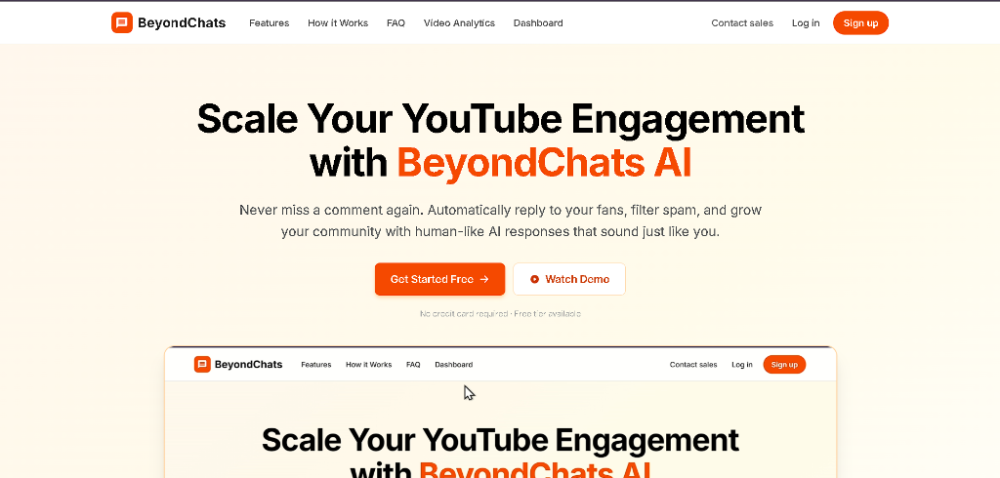
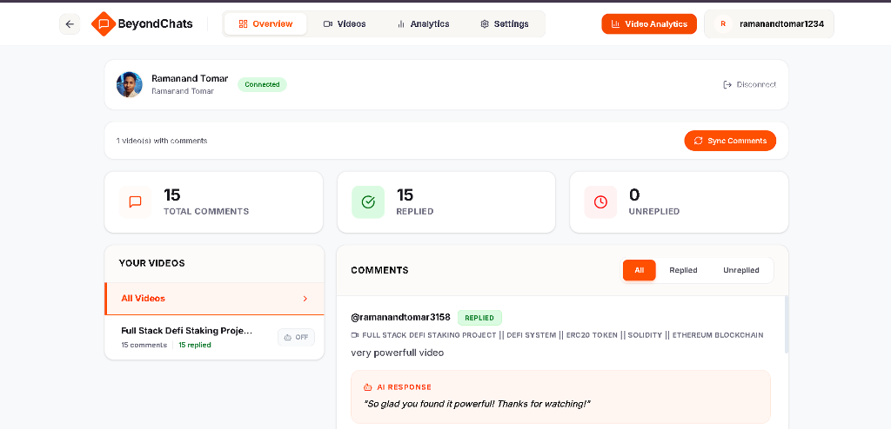
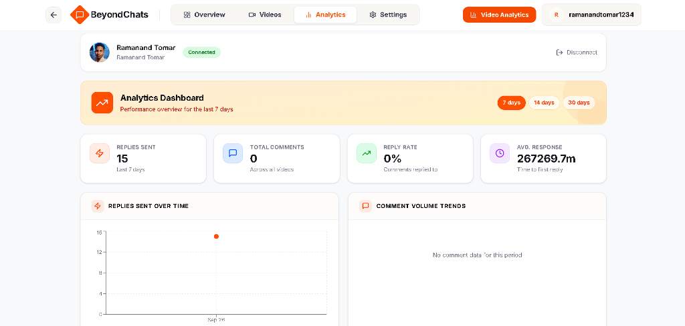
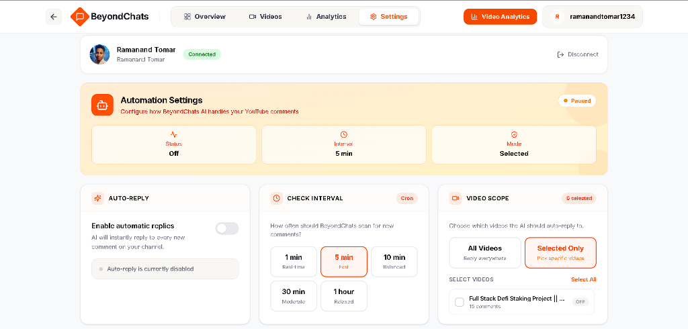

# 🎥 YouTube Comment Automation & AI Reply Bot

> A powerful full-stack AI automation tool that monitors your YouTube channel for new comments, generates personalized, human-like responses using Google Gemini AI, and automatically posts replies back to YouTube.

[](https://beyondchats-youtube-automation.vercel.app)
[](https://github.com/Ramanand-tomar/youtube-comments-automation)

---

## 🌐 Live Application

Check out the live interactive dashboard:
👉 **[BeyondChats YouTube Automation Dashboard](https://beyondchats-youtube-automation.vercel.app/dashboard)**

---

## 📸 Application Screenshots

### Landing Page


### Comments Overview & AI Replies


### Analytics Dashboard


### Automation & Cron Settings


---

## 🚀 Features

- **Automated Monitoring**: Periodically scans your YouTube channel for new comments using background cron jobs.
- **AI-Powered Replies**: Uses Google's Gemini Flash model to generate friendly, context-aware responses.
- **Spam & Link Filtering**: Automatically detects and skips spammy comments or unauthorized links.
- **Interactive Dashboard**: Modern React dashboard to inspect comments, trigger manual syncs, analyze stats, and manage settings.
- **Database Storage**: Tracks all processed comments and replies in MongoDB to prevent duplicate processing.
- **Manual Sync & Control**: Instant API endpoints and dashboard controls to trigger comment syncs anytime.
- **Robust Error Handling**: Gracefully manages YouTube API quotas and connection failures.

---

## 🛠️ Tech Stack

- **Frontend**: React (Vite), Tailwind CSS, Lucide Icons, Recharts (Hosted on **Vercel**)
- **Backend**: Node.js & Express (Hosted on **Render**)
- **Database**: MongoDB (Mongoose)
- **AI**: Google Generative AI (Gemini Flash)
- **Platform API**: YouTube Data API v3 (OAuth 2.0)
- **Scheduling**: Node-cron

---

## 📋 Prerequisites

Before running locally, ensure you have:

- [Node.js](https://nodejs.org/) (v16 or higher)
- [MongoDB Atlas](https://www.mongodb.com/cloud/atlas) account and connection string
- [Google Cloud Console](https://console.cloud.google.com/) Project with:
  - **YouTube Data API v3** enabled
  - **OAuth 2.0 Credentials** (Client ID & Client Secret)
- [Google AI Studio](https://aistudio.google.com/) API Key for Gemini

---

## ⚙️ Setup Instructions

### 1. Clone the Repository
```bash
git clone https://github.com/Ramanand-tomar/youtube-comments-automation.git
cd youtube-automation
```

### 2. Install Dependencies
```bash
# Install root/backend dependencies
npm install

# Install frontend dependencies
cd client && npm install && cd ..
```

### 3. Configure Environment Variables
Create a `.env` file in the root directory:

```env
PORT=3000
MONGO_URI=your_mongodb_connection_string
GEMINI_API_KEY=your_gemini_api_key

# YouTube API Credentials
CLIENT_ID=your_google_client_id
CLIENT_SECRET=your_google_client_secret
REDIRECT_URI=http://localhost:3000
CHANNEL_ID=your_youtube_channel_id

# Obtained via token helper
REFRESH_TOKEN=your_refresh_token
JWT_SECRET=your_jwt_secret
FRONTEND_URL=http://localhost:5173
```

### 4. Obtain YouTube Refresh Token
Since YouTube OAuth tokens expire, you need a `REFRESH_TOKEN` for unattended operation:

1. Add your `CLIENT_ID`, `CLIENT_SECRET`, and `REDIRECT_URI` to `.env`.
2. Run the helper script:
   ```bash
   node services/tokenHelper.js
   ```
3. Open the generated authorization URL in your browser, approve permissions, and paste the code back into your terminal.
4. Copy the output `REFRESH_TOKEN` into your `.env` file.

---

## 🏃 Running the Project

### Development Mode (Full-stack)
```bash
# Run backend server
npm run dev

# Run React frontend (in another terminal)
cd client
npm run dev
```

### Production Mode
```bash
npm run build
npm start
```

---

## 📂 Project Structure

```text
├── client/              # React (Vite) Frontend
│   ├── src/             # Dashboard UI components & views
│   └── public/          # Static assets
├── config/              # Database & authentication config
├── controllers/         # API request handlers
├── cron/                # Scheduled cron job tasks
├── docs/                # Project documentation & screenshots
│   └── screenshots/     # Dashboard screenshots
├── middleware/          # JWT & Auth middleware
├── models/              # Mongoose database schemas
├── routes/              # Express API endpoints
├── services/            # Core business logic (YouTube, Gemini AI, Cron)
├── server.js            # Express application entry point
└── render.yaml          # Render deployment configuration
```

---

## 🛡️ License

This project is licensed under the ISC License.
